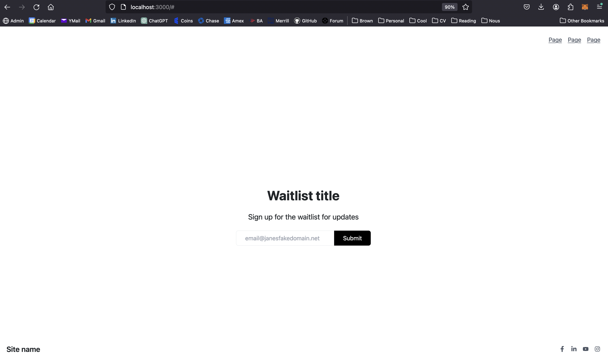

# Figma Translator
Convert any Figma file into a real, working, editable React development environment. ***Your high school level Frontend Software engineer!***

# About
Welcome! If you're here you're probably a terrible frontend engineer, just like me. Why not automate this instead?

In ~1.25 minutes, Figma Translator generates a React frontend for your design all *zero-shot*, including a Yarn environment to build on top of after.

## Details
* Input a Figma file ID, found on the web in `https://figma.com/design/<YOUR_ID_HERE>`
* A `yarn` react environment will spin up with your component created and running
* The translator has access to Javascript, React, Bootstrap, Tailwind, and React Icons to complete the code
* Images and dedicated code files will generate in their respective folders for you to monitor it's progress
* You can toggle the creation of a test environment and only output the code files and images if you'd like as well

# Example
```python
from figmatranslator import FigmaTranslator
ft = FigmaTranslator(project_name="my_first_project", test_environment=True)
ft.translate(figma_file_id="<YOUR ID HERE>", output_image_filename="example.png")
```
* In this code sample, the following will occur:
    * A new test environment called my_first_project will be created
    * Images of your Figma file will be downloaded
    * Your Figma file will be converted to code, saved to a file, then integrated into the test environment in `App.js`
    * The test environment will start!

# Limitations
* Currently, we can only pull one screen from your Figma file
* Any external imports, notably Shadcn, are not supported
* As you'd expect, running this on complex Figma designs, like that of mobile devices, gets pretty bad pretty fast!
    * I found this works best on standard desktop apps, but I'm imagining this will definitely improve over time


# Examples

Here are some examples of how the Figma to UI Translator works:

## Input Figma Design


This image shows an example Figma design for a waitlist signup page.

## Generated React UI


This image demonstrates the React UI component generated from the Figma design above. As you can see, the translator accurately converts the visual design into functional React code, including layout, styling, and interactive elements. ***It did this one-shot, with no extra prompting or agentic loops required***.
